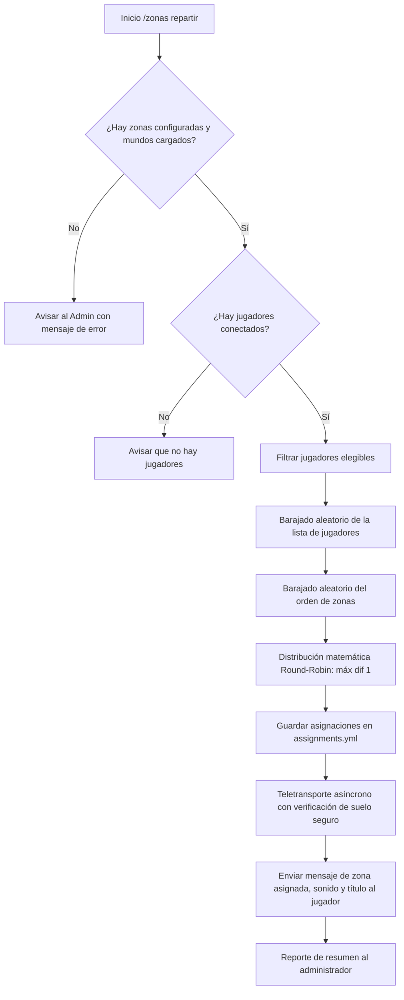

# 🏝️ IslandZones

[](https://www.minecraft.net/)
[](https://papermc.io/)
[](https://www.oracle.com/java/)
[]()

**IslandZones** es un plugin profesional y de alto rendimiento para **Minecraft Java 1.21.1** (totalmente optimizado para servidores **Paper**, **Spigot**, **Purpur** y **Arclight**) cuyo objetivo principal es **dividir y repartir automáticamente a grandes cantidades de jugadores entre diferentes zonas o localizaciones de una isla enorme**.

El sistema garantiza una **distribución matemáticamente equilibrada** (con una diferencia máxima de 1 jugador entre zonas) y **100% aleatoria** antes de cada reparto, teletransportando a cada jugador de manera segura y registrando qué jugador pertenece a cada zona.

---

## 📋 Tabla de Contenidos

- [Características Principales](#-características-principales)
- [Requisitos](#-requisitos)
- [Instalación](#-instalación)
- [Cómo Funciona el Reparto](#-cómo-funciona-el-reparto)
  - [1. Barajado Aleatorio](#1-barajado-aleatorio)
  - [2. Equilibrio Matemático Perfecto](#2-equilibrio-matemático-perfecto)
  - [3. Ejemplos de Distribución](#3-ejemplos-de-distribución)
- [Comandos](#-comandos)
- [Permisos](#-permisos)
- [Configuración (`config.yml`)](#-configuración-configyml)
- [Almacenamiento de Asignaciones (`assignments.yml`)](#-almacenamiento-de-asignaciones)
- [Compilación del Proyecto](#-compilación-del-proyecto)
  - [Opción 1: Script Directo PowerShell (`build.ps1`)](#opción-1-script-directo-powershell-buildps1)
  - [Opción 2: Compilación con Maven](#opción-2-compilación-con-maven)
  - [Opción 3: Compilación con Gradle](#opción-3-compilación-con-gradle)
- [Subir y Gestionar en GitHub](#-subir-y-gestionar-en-github)

---

## ✨ Características Principales

* 🌐 **Zonas Ilimitadas y Configurables:** Sin límites prefijados. Puedes configurar 1, 2, 4, 8, 10, 20 o las zonas que requiera tu isla.
* 🎲 **Reparto Aleatorio Imparcial:** Antes de asignar, los jugadores se mezclan aleatoriamente para que los mismos jugadores nunca acaben siempre en los mismos puntos de inicio.
* ⚖️ **Equilibrio Matemático Garantizado:** La diferencia entre la zona más poblada y la menos poblada es de **como máximo 1 jugador** en cualquier situación.
* 🛡️ **Manejo Dinámico de Casos Extremos:**
  * Si hay más zonas que jugadores, las zonas necesarias reciben 1 jugador y las restantes quedan vacías sin producir ningún error.
  * Si hay 1 sola zona, todos los jugadores son enviados allí.
* 🚀 **Teletransporte Asíncrono y Seguro:**
  * Compatible con la API `teleportAsync` de Paper 1.21.1 para evitar congelar el servidor (*lag spikes*) al cargar chunks lejanos de la isla.
  * **Sistema anti-asfixia:** Comprueba si la ubicación está bloqueada o es peligrosa (lava, vacío o bloques sólidos) y reajusta automáticamente la altura a un bloque seguro.
* 💾 **Persistencia de Asignaciones:** Los jugadores asignados a cada zona se guardan de forma segura en `assignments.yml`, manteniéndose tras reinicios o desconexiones.
* 🎨 **Personalización Total:** Todos los mensajes, prefijos, títulos en pantalla y sonidos son modificables desde `config.yml`, con soporte para códigos de color clásicos (`&a`, `&6`, etc.) y colores Hex (`&#RRGGBB`).
* ⌨️ **Autocompletado Inteligente (`TabCompleter`):** Autocompleta subcomandos, nombres de zonas registradas, coordenadas del administrador (`~ ~ ~`) y nombres de jugadores.

---

## 📌 Requisitos

* **Minecraft Java:** Versión `1.21.1`
* **Servidor compatible:** Paper 1.21.1 (recomendado), Purpur 1.21.1, Spigot 1.21.1 o Arclight 1.21.1
* **Java:** JDK / JRE `21` o superior

---

## 🚀 Instalación

1. Descarga o compila el archivo `IslandZones-1.0.0.jar`.
2. Detén tu servidor de Minecraft.
3. Coloca el archivo `.jar` dentro de la carpeta `plugins/` de tu servidor.
4. Inicia el servidor para que se genere la carpeta `plugins/IslandZones/` con los archivos `config.yml` y `assignments.yml`.
5. ¡Listo! Puedes configurar tus zonas ingame o editando directamente el archivo `config.yml`.

---

## 🧠 Cómo Funciona el Reparto

Cuando ejecutas `/zonas repartir`:



### 1. Barajado Aleatorio
El algoritmo clona la lista de jugadores elegibles y aplica un barajado estocástico (`Collections.shuffle(players, ThreadLocalRandom.current())`). Además, se baraja el orden de las zonas activas para que las zonas que reciben jugadores adicionales en repartos no exactos varíen en cada ejecución.

### 2. Equilibrio Matemático Perfecto
Dados $N$ jugadores y $K$ zonas activas:
* Si $K \ge N$: Se utilizan las primeras $N$ zonas (1 jugador cada una) y $K - N$ zonas quedan con 0 jugadores.
* Si $K < N$: Cada zona recibe al menos $b = \lfloor N / K \rfloor$ jugadores. Las $r = N \bmod K$ zonas seleccionadas al azar reciben $b + 1$ jugadores.
* **Resultado:** La diferencia entre cualquier par de zonas activas es siempre $\le 1$.

### 3. Ejemplos de Distribución

| Jugadores ($N$) | Zonas ($K$) | Resultado por Zona | Diferencia Máxima |
| :---: | :---: | :--- | :---: |
| **20** | **4** | 5, 5, 5, 5 | **0** |
| **22** | **4** | 6, 6, 5, 5 | **1** |
| **32** | **6** | 6, 6, 5, 5, 5, 5 | **1** |
| **80** | **8** | 10, 10, 10, 10, 10, 10, 10, 10 | **0** |
| **83** | **8** | 11, 11, 11, 10, 10, 10, 10, 10 | **1** |
| **3** | **10** | 1, 1, 1 (las otras 7 con 0) | **1** |

---

## 🕹️ Comandos

Todos los comandos se ejecutan bajo `/zonas` (con alias disponibles: `/zones`, `/islandzones`, `/iz`).

| Comando | Descripción |
| :--- | :--- |
| `/zonas añadir <nombre>` | Crea o actualiza una zona utilizando tu **posición actual**, orientación (yaw/pitch) y mundo. |
| `/zonas añadir <nombre> <x> <y> <z> [yaw] [pitch] [mundo]` | Crea una zona introduciendo las coordenadas manualmente. |
| `/zonas eliminar <nombre>` | Elimina una zona y limpia las asignaciones de sus jugadores. |
| `/zonas lista` | Muestra la lista de todas las zonas creadas y el número de jugadores asignados. |
| `/zonas info <nombre>` | Muestra información detallada de una zona (mundo, coordenadas, orientación y jugadores). |
| `/zonas repartir` | **Ejecuta el reparto automático, aleatorio y equilibrado** con teletransporte. |
| `/zonas estado` | Muestra el recuento general de jugadores por zona y totales de la isla. |
| `/zonas jugadores <nombre>` | Muestra la lista nominal de jugadores en esa zona (indicando si están conectados o desconectados). |
| `/zonas mover <jugador> <zona>` | Mueve y teletransporta manualmente a un jugador a una zona específica. |
| `/zonas recargar` | Recarga la configuración `config.yml`, zonas y mensajes en caliente sin reiniciar el servidor. |
| `/zonas ayuda` | Muestra el menú de ayuda con todos los comandos disponibles. |

---

## 🔒 Permisos

| Permiso | Descripción | Por defecto |
| :--- | :--- | :---: |
| `zonas.admin` | Permiso de administración para crear, eliminar, repartir, mover y recargar zonas. | `OP` |

Los jugadores normales sin este permiso no pueden ejecutar ningún comando administrativo.

---

## ⚙️ Configuración (`config.yml`)

```yaml
# ==============================================================================
#                 IslandZones - Configuración Principal (1.21.1)
# ==============================================================================

settings:
  # Evita asfixia en bloques sólidos, lava y vacío ajustando la coordenada Y al suelo transitable
  safe_teleport: true
  
  # Si es true, los jugadores en modo espectador son omitidos del reparto
  ignore_spectators: true
  
  # Si es true, los administradores (OPs) no serán teletransportados
  ignore_ops: false
  
  effects:
    play_sound: true
    sound: "ENTITY_ENDERMAN_TELEPORT"
    volume: 1.0
    pitch: 1.0
    send_title: true
    title: "&6&lZONA ASIGNADA"
    subtitle: "&eHas sido enviado a: &a%zone%"
    fade_in: 10
    stay: 60
    fade_out: 20

zones:
  zona_bosque:
    world: world
    x: 100.5
    y: 80.0
    z: 200.5
    yaw: 0.0
    pitch: 0.0

  zona_desierto:
    world: world
    x: -500.5
    y: 75.0
    z: 300.5
    yaw: 90.0
    pitch: 0.0

  zona_montana:
    world: world
    x: 800.5
    y: 90.0
    z: -400.5
    yaw: 180.0
    pitch: 0.0

  zona_jungla:
    world: world
    x: -700.5
    y: 85.0
    z: -600.5
    yaw: 270.0
    pitch: 0.0

messages:
  prefix: "&8[&6&lIslandZones&8] &r"
  no_permission: "&cNo tienes permisos suficientes para ejecutar este comando (&7zonas.admin&c)."
  only_players: "&cEste subcomando solo puede ser ejecutado por un jugador dentro del juego."
  unknown_subcommand: "&cSubcomando desconocido. Escribe &e/zonas ayuda &cpara ver la lista de comandos."
  
  zone_created: "&a¡Zona &e%zone% &acreada exitosamente en &f%world% (X: %x%, Y: %y%, Z: %z%)&a!"
  zone_deleted: "&cZona &e%zone% &celiminada correctamente."
  zone_already_exists: "&cYa existe una zona con el nombre &e%zone%&c."
  zone_not_found: "&cLa zona &e%zone% &cno existe en la configuración."
  invalid_coordinates: "&cLas coordenadas especificadas no son válidas."
  world_not_found: "&cEl mundo &e%world% &cno existe o no está cargado."
  
  no_zones: "&cNo hay zonas configuradas en el servidor. Usa &e/zonas añadir&c."
  no_players: "&cNo hay jugadores conectados para repartir."
  
  distribution_started: "&eIniciando reparto aleatorio de &a%players% jugadores &eentre &b%zones% zonas&e..."
  distribution_completed: "&a¡Reparto completado! Teletransportados &f%players% jugadores &aen &f%zones% zonas &a(Diferencia máx: &e%max_diff%&a)."
  assigned_notification: "&aHas sido asignado y teletransportado a la zona: &e&l%zone%&a."
  
  player_moved: "&aEl jugador &e%player% &aha sido movido a la zona &b%zone%&a."
  player_not_found: "&cEl jugador &e%player% &cno está conectado al servidor."
  config_reloaded: "&a¡Configuración de IslandZones recargada con éxito!"
```

---

## 📂 Almacenamiento de Asignaciones

Las asignaciones de los jugadores se almacenan en el archivo `plugins/IslandZones/assignments.yml`.

Ejemplo de estructura interna:

```yaml
assignments:
  a1b2c3d4-e5f6-7a8b-9c0d-1e2f3a4b5c6d:
    name: Aitor
    zone: zona_bosque
  f9e8d7c6-b5a4-3210-9876-543210abcdef:
    name: Pedro
    zone: zona_desierto
```

Este archivo se actualiza automáticamente al:
1. Ejecutar un nuevo reparto con `/zonas repartir`.
2. Mover manualmente a un jugador con `/zonas mover`.
3. Eliminar una zona con `/zonas eliminar`.
4. Conectarse nuevos jugadores asignados previamente.

---

## 🛠️ Compilación del Proyecto

El proyecto soporta tres métodos de compilación:

### Opción 1: Script Directo PowerShell (`build.ps1`)
El método más rápido y directo en Windows con JDK instalado (no requiere tener Maven ni Gradle instalados globalmente):

```powershell
powershell -ExecutionPolicy Bypass -File .\build.ps1
```

Genera el archivo `IslandZones-1.0.0.jar` en la raíz del proyecto y, si detecta la carpeta de tu servidor Arclight (`C:\Users\aitor\Desktop\Arclight\plugins`), ¡lo copia automáticamente allí!

### Opción 2: Compilación con Maven
Si dispones de Maven en tu sistema o CI/CD:

```bash
mvn clean package
```
El archivo `.jar` se generará en la carpeta `target/`.

### Opción 3: Compilación con Gradle
Si utilizas Gradle:

```bash
gradle build
```
El archivo `.jar` se generará en la carpeta `build/libs/`.

---

## 🌐 Subir y Gestionar en GitHub

El proyecto está 100% preparado y optimizado para alojarse en GitHub:

1. **`.gitignore` preconfigurado:** Evita que se suban carpetas pesadas de compilación (`build/`, `target/`), binarios `.jar` generados, archivos de datos del servidor (`assignments.yml`) o configuraciones locales del IDE.
2. **Historial de Commits recomendado:**
   ```bash
   git init
   git add .
   git commit -m "feat: Initial plugin setup for IslandZones (Paper 1.21.1)"
   ```
3. **Conectar a tu repositorio remoto de GitHub:**
   ```bash
   git remote add origin https://github.com/TU_USUARIO/island-zones.git
   git branch -M main
   git push -u origin main
   ```

---

## 📄 Licencia

Este proyecto se distribuye bajo la licencia **MIT**. Puedes utilizarlo, modificarlo y distribuirlo libremente en tus servidores de Minecraft.
